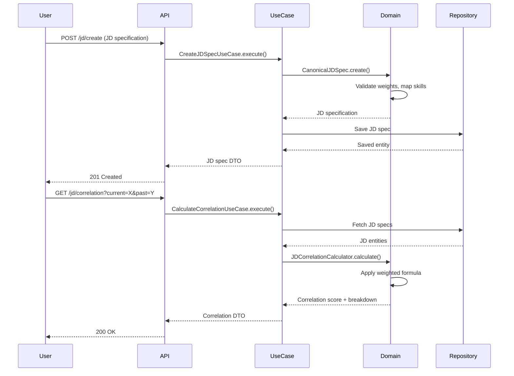

# Design Document: Enhanced Skill Matching

## Overview

The Enhanced Skill Matching System implements a **JD-to-JD correlation engine** that evaluates resume reusability based on job description similarity rather than direct resume-to-JD matching. The core insight is that resumes are optimized for their original job descriptions, so the key question becomes: "How similar is the current JD to past JDs?"

The system uses a **6-layer weighted architecture** where job descriptions are normalized into canonical specifications with weighted skills across frontend, backend, database, cloud, devops, and others layers. Correlation is calculated using a deterministic formula that respects both layer importance and skill weights within layers.

**Key Design Principles:**
- **Clean Architecture**: Pure domain logic with no infrastructure dependencies
- **Domain-Driven Design**: Rich domain models with business logic encapsulation
- **Deterministic Scoring**: Reproducible correlation scores using mathematical formulas
- **Dictionary Versioning**: Stable scoring over time with auditable dictionary changes
- **Manual JD Specification**: Users provide JD specifications in the canonical format
- **Property-Based Testing**: Comprehensive correctness validation using fast-check

## Architecture

### Layer Structure

```
┌─────────────────────────────────────────────────────────────┐
│                    Presentation Layer                        │
│  (API Controllers, Request/Response DTOs)                    │
└─────────────────────────────────────────────────────────────┘
                            │
┌─────────────────────────────────────────────────────────────┐
│                    Application Layer                         │
│  (Use Cases, Application Services)                           │
└─────────────────────────────────────────────────────────────┘
                            │
┌─────────────────────────────────────────────────────────────┐
│                      Domain Layer                            │
│  (Entities, Value Objects, Domain Services)                  │
│                                                               │
│  ┌──────────────────┐  ┌──────────────────┐                │
│  │ CanonicalJDSpec  │  │ SkillDictionary  │                │
│  │  (Aggregate)     │  │   (Aggregate)    │                │
│  └──────────────────┘  └──────────────────┘                │
│                                                               │
│  ┌──────────────────┐  ┌──────────────────┐                │
│  │ JDCorrelation    │  │ SkillReviewQueue │                │
│  │ Calculator       │  │   (Aggregate)    │                │
│  │ (Domain Service) │  └──────────────────┘                │
│  └──────────────────┘                                        │
└─────────────────────────────────────────────────────────────┘
                            │
┌─────────────────────────────────────────────────────────────┐
│                  Infrastructure Layer                        │
│  (Repositories, External Services, Persistence)              │
│                                                               │
│  ┌──────────────────┐                                        │
│  │ MongoDB          │                                        │
│  │ Repositories     │                                        │
│  └──────────────────┘                                        │
└─────────────────────────────────────────────────────────────┘
```

### Component Interaction Flow



## Components and Interfaces

### Domain Layer

#### 1. CanonicalJDSpec (Aggregate Root)

**Purpose**: Represents a normalized, layer-complete job description specification with weighted skills.

**Responsibilities**:
- Enforce 6-layer structure (frontend, backend, database, cloud, devops, others)
- Validate layer weights sum to 1.0 (±0.001 tolerance)
- Validate skill weights within each layer sum to 1.0 (±0.001 tolerance)
- Store canonical skill identifiers only
- Track dictionary version used for normalization

**Interface**:
```typescript
class CanonicalJDSpec {
  private readonly id: string;
  private readonly role: string;
  private readonly layerWeights: LayerWeights;
  private readonly skills: LayerSkills;
  private readonly dictionaryVersion: string;
  private readonly createdAt: Date;

  static create(data: CreateJDSpecData): CanonicalJDSpec;
  
  getId(): string;
  getRole(): string;
  getLayerWeight(layer: TechLayer): number;
  getSkillsForLayer(layer: TechLayer): SkillWeight[];
  getDictionaryVersion(): string;
  getCreatedAt(): Date;
  
  toJSON(): CanonicalJDSpecJSON;
}
```

**Value Objects**:
```typescript
type TechLayer = 'frontend' | 'backend' | 'database' | 'cloud' | 'devops' | 'others';

interface LayerWeights {
  frontend: number;
  backend: number;
  database: number;
  cloud: number;
  devops: number;
  others: number;
}

interface SkillWeight {
  skill: string;  // canonical skill ID
  weight: number; // 0-1
}

interface LayerSkills {
  frontend: SkillWeight[];
  backend: SkillWeight[];
  database: SkillWeight[];
  cloud: SkillWeight[];
  devops: SkillWeight[];
  others: SkillWeight[];
}
```

**Invariants**:
- All six layers must be present in layerWeights
- All six layers must be present in skills
- Sum of layer weights must equal 1.0 (±0.001)
- Sum of skill weights within each layer must equal 1.0 (±0.001)
- All skill identifiers must be non-empty strings
- Dictionary version must be in format "YYYY.N"

#### 2. SkillDictionary (Aggregate Root)

**Purpose**: Manages the canonical skills dictionary with versioning and skill variations.

**Responsibilities**:
- Store canonical skills with metadata
- Map skill variations to canonical forms
- Track dictionary versions
- Provide skill lookup and validation
- Support CRUD operations on skills

**Interface**:
```typescript
class SkillDictionary {
  private readonly version: string;
  private readonly skills: Map<string, CanonicalSkill>;
  private readonly variations: Map<string, string>; // variation -> canonical
  private readonly createdAt: Date;

  static create(version: string): SkillDictionary;
  static fromJSON(data: SkillDictionaryJSON): SkillDictionary;
  
  getVersion(): string;
  addCanonicalSkill(name: string, category: TechLayer): void;
  addSkillVariation(variation: string, canonicalName: string): void;
  removeCanonicalSkill(name: string): void;
  
  getCanonicalSkill(name: string): CanonicalSkill | null;
  mapToCanonical(skillName: string): string | null;
  hasSkill(skillName: string): boolean;
  
  getAllSkills(): CanonicalSkill[];
  getSkillsByCategory(category: TechLayer): CanonicalSkill[];
  getVariationsFor(canonicalName: string): string[];
  
  incrementVersion(): string;
  toJSON(): SkillDictionaryJSON;
}
```

**Value Objects**:
```typescript
interface CanonicalSkill {
  name: string;
  category: TechLayer;
  createdAt: Date;
}
```

#### 3. JDCorrelationCalculator (Domain Service)

**Purpose**: Calculates correlation scores between two JD specifications using the weighted formula.

**Responsibilities**:
- Implement layer correlation formula
- Implement overall JD correlation formula
- Provide correlation breakdown by layer
- Identify matching and missing skills per layer

**Interface**:
```typescript
class JDCorrelationCalculator {
  calculate(currentJD: CanonicalJDSpec, pastJD: CanonicalJDSpec): CorrelationResult;
  
  private calculateLayerCorrelation(
    currentSkills: SkillWeight[],
    pastSkills: SkillWeight[],
    layer: TechLayer
  ): LayerCorrelationResult;
  
  private calculateSkillSimilarity(
    currentSkill: string,
    pastSkill: string
  ): number;
}
```

**Result Objects**:
```typescript
interface CorrelationResult {
  overallScore: number; // 0-1
  layerBreakdown: Map<TechLayer, LayerCorrelationResult>;
  currentDictionaryVersion: string;
  pastDictionaryVersion: string;
}

interface LayerCorrelationResult {
  score: number; // 0-1
  matchingSkills: string[];
  missingSkills: string[];
  layerWeight: number;
}
```

**Algorithm**:
```
For each layer L:
  layerCorrelation(L) = Σ (weightCurrent(skill) × weightPast(skill) × similarity(skillCurrent, skillPast))
  
  Where similarity:
    - Exact match: 1.0
    - Similar skill (future: from skill graph): (0, 1)
    - Missing skill: 0.0

Overall JD Correlation:
  JD_Correlation = Σ (layerCorrelation(L) × layerWeightCurrent(L))
```

#### 4. SkillReviewQueue (Aggregate Root)

**Purpose**: Manages unknown skills awaiting human review and approval.

**Responsibilities**:
- Queue unknown skills for review
- Prevent duplicate entries
- Track skill frequency and first detection
- Support approve/reject decisions
- Maintain audit trail

**Interface**:
```typescript
class SkillReviewQueue {
  private readonly items: Map<string, UnknownSkillItem>;

  addUnknownSkill(skillName: string, detectedIn: string): void;
  getQueueItems(): UnknownSkillItem[];
  approveAsCanonical(skillName: string, category: TechLayer): ApprovalDecision;
  approveAsVariation(skillName: string, canonicalName: string): ApprovalDecision;
  reject(skillName: string, reason: string): RejectionDecision;
  
  hasSkill(skillName: string): boolean;
  getItemByName(skillName: string): UnknownSkillItem | null;
}
```

**Value Objects**:
```typescript
interface UnknownSkillItem {
  skillName: string;
  frequency: number;
  firstDetectedAt: Date;
  detectedIn: string[]; // JD IDs where this skill appeared
  status: 'pending' | 'approved' | 'rejected';
}

interface ApprovalDecision {
  skillName: string;
  decision: 'canonical' | 'variation';
  canonicalName: string;
  category?: TechLayer;
  approvedAt: Date;
}

interface RejectionDecision {
  skillName: string;
  reason: string;
  rejectedAt: Date;
}
```

### Application Layer

#### Use Cases

1. **CreateJDSpecUseCase**
   - Input: JD specification data (role, layerWeights, skills, dictionaryVersion)
   - Output: CanonicalJDSpec
   - Dependencies: SkillDictionary, SkillReviewQueue, JDSpecRepository

2. **CalculateCorrelationUseCase**
   - Input: Current JD ID, Past JD ID
   - Output: CorrelationResult
   - Dependencies: JDSpecRepository, JDCorrelationCalculator

3. **CalculateResumeMatchRateUseCase**
   - Input: Current JD ID, Resume ID
   - Output: ResumeMatchResult
   - Dependencies: JDSpecRepository, ResumeRepository, JDCorrelationCalculator

4. **ManageSkillDictionaryUseCase**
   - Operations: Add/Remove/Update skills, Add variations
   - Dependencies: SkillDictionaryRepository

5. **ReviewUnknownSkillsUseCase**
   - Operations: Approve/Reject unknown skills
   - Dependencies: SkillReviewQueue, SkillDictionary

6. **ExportDictionaryUseCase**
   - Input: None
   - Output: Dictionary JSON
   - Dependencies: SkillDictionaryRepository

7. **ImportDictionaryUseCase**
   - Input: Dictionary JSON
   - Output: Success/Failure
   - Dependencies: SkillDictionaryRepository

### Infrastructure Layer

#### Repositories

1. **IJDSpecRepository**
```typescript
interface IJDSpecRepository {
  save(spec: CanonicalJDSpec): Promise<void>;
  findById(id: string): Promise<CanonicalJDSpec | null>;
  findAll(): Promise<CanonicalJDSpec[]>;
  update(spec: CanonicalJDSpec): Promise<void>;
  delete(id: string): Promise<void>;
}
```

2. **ISkillDictionaryRepository**
```typescript
interface ISkillDictionaryRepository {
  save(dictionary: SkillDictionary): Promise<void>;
  getCurrent(): Promise<SkillDictionary>;
  getVersion(version: string): Promise<SkillDictionary | null>;
  getAllVersions(): Promise<SkillDictionary[]>;
}
```

3. **ISkillReviewQueueRepository**
```typescript
interface ISkillReviewQueueRepository {
  save(queue: SkillReviewQueue): Promise<void>;
  get(): Promise<SkillReviewQueue>;
}
```

## Data Models

### MongoDB Collections

#### 1. jd_specifications
```json
{
  "_id": "ObjectId",
  "role": "string",
  "layerWeights": {
    "frontend": "number",
    "backend": "number",
    "database": "number",
    "cloud": "number",
    "devops": "number",
    "others": "number"
  },
  "skills": {
    "frontend": [{"skill": "string", "weight": "number"}],
    "backend": [{"skill": "string", "weight": "number"}],
    "database": [{"skill": "string", "weight": "number"}],
    "cloud": [{"skill": "string", "weight": "number"}],
    "devops": [{"skill": "string", "weight": "number"}],
    "others": [{"skill": "string", "weight": "number"}]
  },
  "dictionaryVersion": "string",
  "createdAt": "Date"
}
```

#### 2. skill_dictionaries
```json
{
  "_id": "ObjectId",
  "version": "string",
  "skills": [
    {
      "name": "string",
      "category": "string",
      "createdAt": "Date"
    }
  ],
  "variations": [
    {
      "variation": "string",
      "canonical": "string"
    }
  ],
  "createdAt": "Date"
}
```

#### 3. skill_review_queue
```json
{
  "_id": "ObjectId",
  "items": [
    {
      "skillName": "string",
      "frequency": "number",
      "firstDetectedAt": "Date",
      "detectedIn": ["string"],
      "status": "string"
    }
  ],
  "updatedAt": "Date"
}
```

#### 4. resumes (updated)
```json
{
  "_id": "ObjectId",
  "company": "string",
  "role": "string",
  "techStack": ["string"],
  "filePath": "string",
  "createdAt": "Date",
  "jdSpecId": "ObjectId"  // NEW: Reference to original JD
}
```

## Correctness Properties

*A property is a characteristic or behavior that should hold true across all valid executions of a system—essentially, a formal statement about what the system should do. Properties serve as the bridge between human-readable specifications and machine-verifiable correctness guarantees.*

Before writing the correctness properties, I need to analyze the acceptance criteria to determine which are testable as properties, examples, or edge cases.


### Property Reflection

After analyzing all acceptance criteria, I've identified several redundant properties that can be consolidated:

**Redundancies Identified:**
1. Requirements 1.3, 1.7, 8.1, 12.4 all test that layer weights sum to 1.0 → Combine into one property
2. Requirements 1.4, 1.8, 8.2, 12.5 all test that skill weights sum to 1.0 per layer → Combine into one property
3. Requirements 6.4 and 8.3 both test that current JD's layer weights are used → Combine into one property
4. Requirements 7.1 and 13.4 both test that resume match rate uses JD-to-JD correlation → Combine into one property
5. Requirements 12.2 and 12.3 both test that all six layers are present → Combine into one property about structure completeness

**Properties to Write:**
After consolidation, we have the following unique, high-value properties to implement:

1. **JD Specification Structure Properties** (Requirements 1.1-1.8, 12.2-12.3)
2. **Weight Validation Properties** (Requirements 1.3-1.4, 1.7-1.8, 8.1-8.2, 12.4-12.5)
3. **Serialization Round-Trip Property** (Requirement 1.6)
4. **Skill Dictionary Properties** (Requirements 2.2-2.3, 2.5)
5. **Dictionary Versioning Properties** (Requirements 3.1-3.4, 3.6)
6. **Skill Mapping Properties** (Requirements 4.7-4.8, 4.10)
7. **Unknown Skill Queue Properties** (Requirements 5.1-5.7)
8. **Correlation Algorithm Properties** (Requirements 6.1-6.7, 8.4-8.5)
9. **Resume Match Rate Properties** (Requirements 7.1-7.2, 7.4-7.7, 13.1-13.5)
10. **Dictionary Import/Export Properties** (Requirements 10.1-10.5)
11. **Skill Usage Statistics Properties** (Requirements 11.1-11.6)
12. **Validation Properties** (Requirements 12.6-12.9)

### Correctness Properties

#### Property 1: JD Specification Layer Completeness
*For any* canonical JD specification, all six layers (frontend, backend, database, cloud, devops, others) must be present in both layerWeights and skills objects.

**Validates: Requirements 1.1, 1.2, 12.2, 12.3**

#### Property 2: Layer Weights Sum to Unity
*For any* canonical JD specification, the sum of all layer weights must equal 1.0 within a tolerance of ±0.001.

**Validates: Requirements 1.3, 1.7, 8.1, 12.4**

#### Property 3: Skill Weights Sum to Unity Per Layer
*For any* canonical JD specification and any layer, the sum of all skill weights within that layer must equal 1.0 within a tolerance of ±0.001.

**Validates: Requirements 1.4, 1.8, 8.2, 12.5**

#### Property 4: Canonical Skill Identifiers Only
*For any* canonical JD specification, all skill identifiers in all layers must be non-empty strings that exist in the canonical dictionary or are flagged as unknown.

**Validates: Requirements 1.5, 12.9**

#### Property 5: JD Specification Serialization Round-Trip
*For any* valid canonical JD specification, serializing to JSON and then deserializing must produce an equivalent specification with identical layer weights, skill weights, role, and dictionary version.

**Validates: Requirement 1.6**

#### Property 6: Canonical Skill Completeness
*For any* canonical skill added to the dictionary, the skill must have a non-empty name, a valid category (one of the six layers), and a creation timestamp.

**Validates: Requirement 2.2**

#### Property 7: Skill Variation Uniqueness
*For any* skill variation added to the dictionary, it must map to exactly one canonical skill, and adding the same variation multiple times must not create duplicate mappings.

**Validates: Requirement 2.3**

#### Property 8: Canonical Skill Deletion Cascade
*For any* canonical skill with associated variations, when the canonical skill is deleted, all associated variations must either be deleted or remapped appropriately.

**Validates: Requirement 2.5**

#### Property 9: Dictionary Version Format
*For any* dictionary version identifier, it must match the format "YYYY.N" where YYYY is a four-digit year and N is a positive integer.

**Validates: Requirement 3.1**

#### Property 10: Dictionary Version Monotonicity
*For any* sequence of dictionary modifications, the version number must increase monotonically (each modification increments the version).

**Validates: Requirement 3.2**

#### Property 11: JD Normalization Version Tracking
*For any* JD specification created through normalization, the dictionary version used during normalization must be recorded and retrievable.

**Validates: Requirements 3.3, 3.6**

#### Property 12: Dictionary Version History Completeness
*For any* dictionary version created, it must be stored in the version history with a timestamp, and all historical versions must remain queryable.

**Validates: Requirement 3.4**

#### Property 13: Skill Mapping Determinism
*For any* skill name that exists in the dictionary (either as canonical or variation), mapping it to canonical form must always return the same canonical skill identifier.

**Validates: Requirement 4.7**

#### Property 14: Unknown Skill Detection
*For any* skill name that does not exist in the dictionary (neither as canonical nor variation), the system must flag it as unknown and add it to the review queue.

**Validates: Requirement 4.8**

#### Property 15: JD Specification Input Validation
*For any* JD specification provided by the user, the input must pass structural validation (all layers present, weights sum to 1.0) before being persisted.

**Validates: Requirement 4.10**

#### Property 16: Unknown Skill Queue Uniqueness
*For any* unknown skill detected multiple times, only one entry must exist in the review queue, with the frequency count incremented for each detection.

**Validates: Requirements 5.1, 5.2**

#### Property 17: Unknown Skill Queue Completeness
*For any* unknown skill in the review queue, it must have a skill name, frequency count, first detection date, and list of JD IDs where it was detected.

**Validates: Requirement 5.3**

#### Property 18: Skill Approval Workflow
*For any* unknown skill approved as canonical, it must be added to the dictionary with the specified category, and for any skill approved as variation, it must be mapped to the specified canonical skill.

**Validates: Requirements 5.4, 5.5**

#### Property 19: Skill Rejection Workflow
*For any* unknown skill rejected from the review queue, it must be removed from the queue and marked as rejected in the audit trail.

**Validates: Requirement 5.6**

#### Property 20: Review Decision Audit Trail
*For any* skill review decision (approve or reject), an audit trail entry must be created with the skill name, decision type, timestamp, and relevant metadata.

**Validates: Requirement 5.7**

#### Property 21: Correlation Calculation Determinism
*For any* two JD specifications, calculating the correlation multiple times with the same inputs must always produce the same result (deterministic calculation).

**Validates: Requirement 6.1**

#### Property 22: Layer Correlation Formula Correctness
*For any* two JD specifications and any layer, the layer correlation must equal the sum of (weightCurrent × weightPast × similarity) for all skill pairs in that layer.

**Validates: Requirement 6.2**

#### Property 23: Overall Correlation Formula Correctness
*For any* two JD specifications, the overall correlation must equal the sum of (layerCorrelation × layerWeightCurrent) across all six layers.

**Validates: Requirement 6.3**

#### Property 24: Current JD Layer Weights Used
*For any* correlation calculation between current and past JDs, the overall correlation must use the current JD's layer weights, not the past JD's layer weights.

**Validates: Requirements 6.4, 8.3**

#### Property 25: Correlation Score Range
*For any* two JD specifications, the correlation score must be in the range [0, 1] inclusive.

**Validates: Requirement 6.5**

#### Property 26: Missing Skill Similarity
*For any* correlation calculation, when a skill exists in one JD but not the other, the similarity for that skill pair must be 0.0.

**Validates: Requirement 6.6**

#### Property 27: Correlation Dictionary Version Tracking
*For any* correlation calculation, the result must include both the current JD's dictionary version and the past JD's dictionary version.

**Validates: Requirement 6.7**

#### Property 28: Skill Weight Contribution
*For any* layer correlation calculation, the contribution of each skill pair must be weighted by both the current JD's skill weight and the past JD's skill weight.

**Validates: Requirement 8.4**

#### Property 29: Zero-Weight Layer No Penalty
*For any* correlation calculation where a layer has zero weight in the current JD, missing skills in that layer must not reduce the overall correlation score.

**Validates: Requirement 8.5**

#### Property 30: Weight Validation During Normalization
*For any* JD normalization attempt, if the layer weights or skill weights do not sum to 1.0 (±0.001 tolerance), the normalization must be rejected with a validation error.

**Validates: Requirement 8.6**

#### Property 31: Resume Match Rate Equals JD Correlation
*For any* resume with an associated original JD, the resume match rate for a current JD must equal the JD-to-JD correlation between the current JD and the resume's original JD.

**Validates: Requirements 7.1, 7.2, 13.4**

#### Property 32: Resume Ranking by Match Rate
*For any* collection of resumes with match rates, they must be sorted in descending order by match rate (highest match first).

**Validates: Requirement 7.4**

#### Property 33: Match Rate Percentage Display
*For any* resume match rate displayed to the user, it must be shown as a percentage in the range [0, 100].

**Validates: Requirement 7.5**

#### Property 34: Correlation Explainability - Layer Breakdown
*For any* correlation calculation, the result must include a breakdown showing each layer's contribution to the overall score.

**Validates: Requirement 7.6**

#### Property 35: Correlation Explainability - Skill Details
*For any* correlation calculation and any layer, the result must include which skills matched and which skills are missing in that layer.

**Validates: Requirement 7.7**

#### Property 36: Resume-JD Association
*For any* resume created for a bid, the resume record must store the JD specification ID of the bid's JD.

**Validates: Requirements 13.1, 13.2**

#### Property 37: Resume Original JD Retrieval
*For any* resume match rate calculation, the system must retrieve the resume's original JD specification before calculating correlation.

**Validates: Requirement 13.3**

#### Property 38: Missing Original JD Handling
*For any* resume whose original JD specification cannot be found, the match rate must be 0.

**Validates: Requirement 13.5**

#### Property 39: Dictionary Export Completeness
*For any* dictionary export, the JSON must include the version, all canonical skills with metadata, all skill variations with mappings, and timestamps.

**Validates: Requirements 10.1, 10.2**

#### Property 40: Dictionary Import Validation
*For any* dictionary import attempt, if the JSON structure is invalid or missing required fields, the import must be rejected with a descriptive error.

**Validates: Requirement 10.3**

#### Property 41: Dictionary Version Protection
*For any* dictionary import attempt, if the imported version is older than the current version, the import must be rejected to prevent version regression.

**Validates: Requirement 10.4**

#### Property 42: Dictionary Merge Correctness
*For any* dictionary import with merge enabled, skills from the imported dictionary must be added to the existing dictionary without removing existing skills.

**Validates: Requirement 10.5**

#### Property 43: Skill Usage Tracking - JD Count
*For any* canonical skill, the system must track how many JD specifications contain that skill, and the count must be accurate.

**Validates: Requirement 11.1**

#### Property 44: Skill Usage Tracking - Resume Count
*For any* canonical skill, the system must track how many resumes contain that skill, and the count must be accurate.

**Validates: Requirement 11.2**

#### Property 45: Skill Statistics Sorting
*For any* skill usage statistics query, the results must be sorted by frequency in descending order (most frequent first).

**Validates: Requirement 11.3**

#### Property 46: Skill Statistics Date Range
*For any* skill usage statistics query, the result must include the date range used for the statistics.

**Validates: Requirement 11.4**

#### Property 47: Skill Statistics Filtering
*For any* skill usage statistics query with a date range filter, only skills used within that date range must be included in the results.

**Validates: Requirement 11.5**

#### Property 48: Skill Variation Statistics
*For any* canonical skill with variations, the statistics must show which variations are most commonly used and their frequencies.

**Validates: Requirement 11.6**

#### Property 49: Skill Name Validation - Empty Rejection
*For any* skill name that is empty or contains only whitespace, the system must reject it with a validation error.

**Validates: Requirement 12.6**

#### Property 50: Skill Name Validation - Length Limit
*For any* skill name longer than 100 characters, the system must reject it with a validation error.

**Validates: Requirement 12.7**

#### Property 51: Skill Name Normalization
*For any* skill name with leading/trailing whitespace or inconsistent casing, the system must normalize it by trimming whitespace and standardizing case before processing.

**Validates: Requirement 12.8**

## Error Handling

### Domain-Level Errors

1. **ValidationError**: Thrown when domain invariants are violated
   - Layer weights don't sum to 1.0
   - Skill weights don't sum to 1.0
   - Invalid dictionary version format
   - Empty or invalid skill names

2. **SkillNotFoundError**: Thrown when a skill lookup fails
   - Canonical skill doesn't exist
   - Skill variation not mapped

3. **DictionaryVersionError**: Thrown for version-related issues
   - Version format invalid
   - Attempting to import older version
   - Version not found in history

4. **CorrelationError**: Thrown during correlation calculation
   - JD specification not found
   - Dictionary version mismatch
   - Invalid correlation inputs

### Application-Level Errors

1. **ValidationError**: Thrown when JD specification validation fails
   - Invalid JSON structure
   - Validation failure for weights or structure

2. **RepositoryError**: Thrown for persistence failures
   - Database connection issues
   - Save/update/delete failures
   - Query failures

3. **ImportExportError**: Thrown during dictionary import/export
   - Invalid JSON format
   - Version conflict
   - Merge failure

### Error Recovery Strategies

1. **Validation Before Persistence**: Catch errors early before database writes
2. **Graceful Degradation**: Return partial results when some data is unavailable
3. **Audit Trail**: Log all errors for debugging and analysis

## Testing Strategy

### Dual Testing Approach

The system uses both **unit tests** and **property-based tests** for comprehensive coverage:

**Unit Tests** focus on:
- Specific examples demonstrating correct behavior
- Edge cases (empty inputs, boundary values, zero weights)
- Error conditions and exception handling
- Integration points between components

**Property-Based Tests** focus on:
- Universal properties that hold for all inputs
- Comprehensive input coverage through randomization
- Invariant validation across random data
- Formula correctness with generated test cases

### Property-Based Testing Configuration

- **Library**: fast-check (TypeScript property-based testing library)
- **Iterations**: Minimum 100 iterations per property test
- **Tagging**: Each property test must reference its design document property
- **Tag Format**: `// Feature: enhanced-skill-matching, Property N: [property text]`

### Test Organization

```
packages/backend/src/
├── domain/
│   ├── CanonicalJDSpec.test.ts          # Unit + Property tests
│   ├── SkillDictionary.test.ts          # Unit + Property tests
│   ├── JDCorrelationCalculator.test.ts  # Unit + Property tests
│   ├── SkillReviewQueue.test.ts         # Unit + Property tests
│   └── ...
├── application/
│   ├── CreateJDSpecUseCase.test.ts      # Unit tests
│   ├── CalculateCorrelationUseCase.test.ts  # Unit tests
│   └── ...
└── infrastructure/
    ├── MongoDBJDSpecRepository.test.ts  # Integration tests
    └── ...
```

### Key Property Test Examples

**Property 2: Layer Weights Sum to Unity**
```typescript
// Feature: enhanced-skill-matching, Property 2: Layer Weights Sum to Unity
it('should ensure layer weights sum to 1.0 for all valid JD specs', () => {
  fc.assert(
    fc.property(
      fc.record({
        frontend: fc.float({ min: 0, max: 1 }),
        backend: fc.float({ min: 0, max: 1 }),
        database: fc.float({ min: 0, max: 1 }),
        cloud: fc.float({ min: 0, max: 1 }),
        devops: fc.float({ min: 0, max: 1 }),
        others: fc.float({ min: 0, max: 1 })
      }).map(normalizeWeights), // Normalize to sum to 1.0
      (layerWeights) => {
        const sum = Object.values(layerWeights).reduce((a, b) => a + b, 0);
        expect(Math.abs(sum - 1.0)).toBeLessThan(0.001);
      }
    ),
    { numRuns: 100 }
  );
});
```

**Property 21: Correlation Calculation Determinism**
```typescript
// Feature: enhanced-skill-matching, Property 21: Correlation Calculation Determinism
it('should produce same correlation for same inputs', () => {
  fc.assert(
    fc.property(
      arbitraryJDSpec(),
      arbitraryJDSpec(),
      (currentJD, pastJD) => {
        const calculator = new JDCorrelationCalculator();
        const result1 = calculator.calculate(currentJD, pastJD);
        const result2 = calculator.calculate(currentJD, pastJD);
        expect(result1.overallScore).toBe(result2.overallScore);
      }
    ),
    { numRuns: 100 }
  );
});
```

**Property 5: JD Specification Serialization Round-Trip**
```typescript
// Feature: enhanced-skill-matching, Property 5: JD Specification Serialization Round-Trip
it('should preserve JD spec through serialization round-trip', () => {
  fc.assert(
    fc.property(
      arbitraryJDSpec(),
      (spec) => {
        const json = spec.toJSON();
        const restored = CanonicalJDSpec.fromJSON(json);
        expect(restored.getRole()).toBe(spec.getRole());
        expect(restored.getDictionaryVersion()).toBe(spec.getDictionaryVersion());
        // Verify all layer weights and skills match
      }
    ),
    { numRuns: 100 }
  );
});
```

### Integration Testing

Integration tests verify:
- MongoDB repository operations
- End-to-end use case flows
- API endpoint functionality

### Test Coverage Goals

- **Domain Layer**: 100% coverage (critical business logic)
- **Application Layer**: 95% coverage
- **Infrastructure Layer**: 85% coverage (excluding external service mocks)
- **Overall**: 90%+ coverage

## Implementation Notes

### Seed Dictionary

The initial seed dictionary should contain 300-500 canonical skills across all six layers:

**Frontend** (80-100 skills): react, vue, angular, svelte, nextjs, typescript, javascript, html, css, sass, webpack, vite, etc.

**Backend** (100-120 skills): nodejs, python, java, go, rust, csharp, express, fastapi, spring, django, flask, nestjs, etc.

**Database** (60-80 skills): postgresql, mysql, mongodb, redis, elasticsearch, dynamodb, cassandra, sqlite, etc.

**Cloud** (60-80 skills): aws, azure, gcp, lambda, s3, ec2, cloudformation, terraform, kubernetes, docker, etc.

**DevOps** (40-60 skills): ci/cd, jenkins, github-actions, gitlab-ci, ansible, puppet, prometheus, grafana, etc.

**Others** (60-80 skills): git, agile, scrum, rest, graphql, websockets, oauth, jwt, testing, tdd, etc.

### Performance Considerations

1. **Caching**: Cache dictionary lookups in memory
2. **Indexing**: Index JD specifications by role and dictionary version
3. **Batch Operations**: Support batch correlation calculations
4. **Lazy Loading**: Load skill variations only when needed
5. **Connection Pooling**: Use MongoDB connection pooling

### Migration Strategy

1. **Phase 1**: Implement domain models and correlation algorithm
2. **Phase 2**: Implement dictionary management and versioning
3. **Phase 3**: Implement unknown skill review workflow
4. **Phase 4**: Update resume-bid association to include JD specs
5. **Phase 5**: Implement statistics and analytics

### Future Enhancements

1. **Skill Similarity Graph**: Add skill similarity scores (e.g., "react" and "vue" have similarity 0.7)
2. **Machine Learning**: Train ML model to improve layer weight assignment
3. **Skill Clustering**: Group related skills for better correlation
4. **Temporal Analysis**: Track skill trends over time
5. **Recommendation Engine**: Suggest skills to add to JDs based on role
