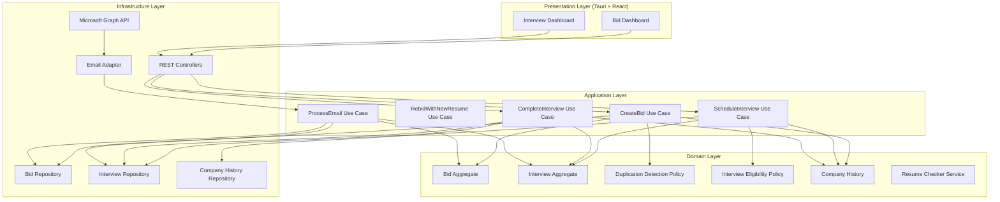

# Design Document: Job Bid and Interview Management System

## Overview

The Job Bid and Interview Management System follows clean architecture and domain-driven design principles with clear separation between domain logic, application services, and infrastructure. The system is organized into four layers:

1. **Domain Layer**: Pure business logic with Bid and Interview aggregates, domain policies, and domain services
2. **Application Layer**: Use cases that orchestrate domain objects and coordinate workflows
3. **Infrastructure Layer**: MongoDB repositories, REST controllers, and Microsoft Graph API integration
4. **Presentation Layer**: Tauri desktop application with React frontend

The architecture ensures that business rules live only in the domain layer, with infrastructure and UI concerns completely separated. All domain objects are pure TypeScript classes without persistence annotations or framework dependencies.

## Architecture

### Layered Architecture Diagram



### Dependency Flow

- Presentation Layer depends on Application Layer (via REST API)
- Application Layer depends on Domain Layer
- Infrastructure Layer depends on Application Layer (implements interfaces) and Domain Layer (for models)
- Domain Layer has NO dependencies on other layers

This ensures the domain remains pure and testable without infrastructure concerns.

## Components and Interfaces

### Domain Layer Components

#### Bid Aggregate

The Bid aggregate represents a job application with its complete lifecycle.

**Fields:**
- `id: string` - Unique identifier
- `date: Date` - Automatically set to today when created
- `link: string` - Job posting URL (manual input)
- `company: string` - Company name or agency name (manual input)
- `client: string` - Actual employer if company is agency (manual input)
- `role: string` - Job role/title (manual input)
- `mainStacks: string[]` - Main technologies/skills (manual input)
- `jobDescription: string` - Job description text (manual input)
- `resume: string` - Resume version used (manual input)
- `bidStatus: BidStatus` - Current status (automated)
- `interviewWinning: boolean` - Whether bid reached HR interview (automated)
- `bidDetail: string` - Additional details including warnings (automated)
- `resumeChecker: ResumeCheckerType | null` - ATS or RECRUITER inference (automated)

**BidStatus Enum:**
```typescript
enum BidStatus {
  NEW = "NEW",
  SUBMITTED = "SUBMITTED",
  REJECTED = "REJECTED",
  INTERVIEW_STAGE = "INTERVIEW_STAGE",
  CLOSED = "CLOSED"
}
```

**ResumeCheckerType Enum:**
```typescript
enum ResumeCheckerType {
  ATS = "ATS",
  RECRUITER = "RECRUITER"
}
```

**Behaviors:**
- `create(data: CreateBidData): Bid` - Static factory method to create new bid
- `markAsSubmitted(): void` - Transition to SUBMITTED status
- `markAsRejected(): void` - Transition to REJECTED status
- `markInterviewStarted(): void` - Set interviewWinning to true and update status to INTERVIEW_STAGE
- `markAsClosed(): void` - Transition to CLOSED status
- `attachWarning(warning: string): void` - Append warning to bidDetail
- `setResumeChecker(type: ResumeCheckerType): void` - Set resume checker inference
- `canRebid(): boolean` - Returns true if status is REJECTED and interviewWinning is false
- `isInterviewStarted(): boolean` - Returns interviewWinning value

**Invariants:**
- Once interviewWinning is true, it cannot be set back to false
- Cannot transition to REJECTED after INTERVIEW_STAGE
- Required fields (link, company, role) must not be empty

#### Interview Aggregate

The Interview aggregate represents an interview session with eligibility validation.

**Fields:**
- `id: string` - Unique identifier
- `date: Date` - Automatically set to today when created
- `base: InterviewBase` - Source of interview (Bid or LinkedIn)
- `company: string` - Company name
- `client: string` - Actual employer if company is agency
- `role: string` - Job role/title
- `jobDescription: string` - Job description
- `resume: string` - Resume version used
- `interviewType: string` - Type of interview (e.g., "HR", "Technical", "Final")
- `recruiter: string` - Recruiter name (manual input)
- `attendees: string[]` - Interview attendee names (manual input)
- `status: InterviewStatus` - Current status
- `detail: string` - Additional details (manual input)
- `bidId: string | null` - Reference to bid if base is Bid

**InterviewBase Enum:**
```typescript
enum InterviewBase {
  BID = "BID",
  LINKEDIN_CHAT = "LINKEDIN_CHAT"
}
```

**InterviewStatus Enum:**
```typescript
enum InterviewStatus {
  SCHEDULED = "SCHEDULED",
  COMPLETED_SUCCESS = "COMPLETED_SUCCESS",
  COMPLETED_FAILURE = "COMPLETED_FAILURE",
  CANCELLED = "CANCELLED"
}
```

**Behaviors:**
- `create(data: CreateInterviewData): Interview` - Static factory method to create new interview
- `markAsCompleted(success: boolean): void` - Mark interview as completed with outcome
- `markAsCancelled(): void` - Mark interview as cancelled
- `isFailed(): boolean` - Returns true if status is COMPLETED_FAILURE
- `getFailureInfo(): FailureInfo` - Returns company, role, recruiter, attendees for failed interview

**Invariants:**
- Cannot transition from COMPLETED_SUCCESS or COMPLETED_FAILURE to SCHEDULED
- Required fields (company, role, recruiter, attendees) must not be empty
- If base is BID, bidId must be set

#### Duplication Detection Policy

Domain policy that identifies potential duplicate bids.

**Interface:**
```typescript
interface DuplicationWarning {
  type: 'LINK_MATCH' | 'COMPANY_ROLE_MATCH';
  existingBidId: string;
  message: string;
}

class DuplicationDetectionPolicy {
  checkDuplication(
    newBid: CreateBidData,
    existingBids: Bid[]
  ): DuplicationWarning[]
}
```

**Logic:**
- Check if link matches any existing bid's link → LINK_MATCH warning
- Check if company + role matches any existing bid's company + role → COMPANY_ROLE_MATCH warning
- Return all warnings found (can have both types)
- Warnings are informational, not blocking

#### Interview Eligibility Policy

Domain policy that validates if a candidate can interview at a company based on history.

**Interface:**
```typescript
interface EligibilityResult {
  allowed: boolean;
  reason: string;
}

class InterviewEligibilityPolicy {
  checkEligibility(
    company: string,
    role: string,
    recruiter: string,
    attendees: string[],
    history: CompanyHistory
  ): EligibilityResult
}
```

**Logic:**
1. Query history for previous failures at company + role
2. If no previous failures → allowed
3. If previous failures exist:
   - Check if recruiter is new (not in previous recruiters list) → allowed
   - Check if ALL attendees are new (none in previous attendees list) → allowed
   - Otherwise → forbidden
4. Return result with explanation

**Example reasons:**
- Allowed: "No previous failures at this company and role"
- Allowed: "New recruiter (previous: John Doe)"
- Allowed: "All new attendees (previous: Jane Smith, Bob Johnson)"
- Forbidden: "Same recruiter (John Doe) and overlapping attendee (Jane Smith)"

#### Company History

Domain model tracking interview failures per company and role.

**Structure:**
```typescript
interface CompanyRoleHistory {
  company: string;
  role: string;
  failures: FailureRecord[];
}

interface FailureRecord {
  interviewId: string;
  date: Date;
  recruiter: string;
  attendees: string[];
}

class CompanyHistory {
  private histories: Map<string, CompanyRoleHistory>;
  
  recordFailure(
    company: string,
    role: string,
    recruiter: string,
    attendees: string[],
    interviewId: string
  ): void
  
  getHistory(company: string, role: string): CompanyRoleHistory | null
  
  getAllRecruiters(company: string, role: string): string[]
  
  getAllAttendees(company: string, role: string): string[]
  
  hasFailures(company: string, role: string): boolean
  
  getWarningMessage(company: string, role: string): string
}
```

**Key for Map:** `${company}:${role}` (normalized to lowercase)

#### Resume Checker Service

Domain service that infers whether ATS or recruiter screens resumes.

**Interface:**
```typescript
interface ResumeCheckerInference {
  type: ResumeCheckerType;
  confidence: number; // 0.0 to 1.0
  reasoning: string;
}

class ResumeCheckerService {
  inferScreeningType(
    bid: Bid,
    rejectionDate: Date,
    companyBids: Bid[]
  ): ResumeCheckerInference
}
```

**Logic:**
1. Calculate time from bid submission to rejection
2. If rejection within 1-3 days → likely ATS (high confidence)
3. If rejection after 4-7 days → likely RECRUITER (medium confidence)
4. If rejection after 8+ days → likely RECRUITER (high confidence)
5. Consider patterns across multiple bids to same company
6. If company consistently rejects quickly → ATS
7. If company has variable rejection times → RECRUITER

**Confidence scoring:**
- High: 0.8-1.0
- Medium: 0.5-0.79
- Low: 0.0-0.49

### Application Layer Components

#### CreateBid Use Case

Orchestrates bid creation with duplication detection and company history warnings.

**Interface:**
```typescript
interface CreateBidRequest {
  link: string;
  company: string;
  client: string;
  role: string;
  mainStacks: string[];
  jobDescription: string;
  resume: string;
}

interface CreateBidResponse {
  bidId: string;
  warnings: DuplicationWarning[];
  companyWarning: string | null;
}

class CreateBidUseCase {
  constructor(
    private bidRepository: IBidRepository,
    private duplicationPolicy: DuplicationDetectionPolicy,
    private companyHistory: CompanyHistory
  )
  
  async execute(request: CreateBidRequest): Promise<CreateBidResponse>
}
```

**Flow:**
1. Validate required fields
2. Fetch all existing bids from repository
3. Run duplication detection policy
4. Check company history for warnings
5. Create new Bid aggregate with today's date
6. Attach company warning to bidDetail if exists
7. Save bid to repository
8. Return bid ID and warnings

#### RebidWithNewResume Use Case

Handles rebidding with updated resume after rejection.

**Interface:**
```typescript
interface RebidRequest {
  originalBidId: string;
  newResume: string;
  newJobDescription?: string; // Optional if job description changed
}

interface RebidResponse {
  newBidId: string;
  allowed: boolean;
  reason: string;
}

class RebidWithNewResumeUseCase {
  constructor(
    private bidRepository: IBidRepository,
    private duplicationPolicy: DuplicationDetectionPolicy,
    private companyHistory: CompanyHistory
  )
  
  async execute(request: RebidRequest): Promise<RebidResponse>
}
```

**Flow:**
1. Fetch original bid from repository
2. Check if rebidding is allowed (canRebid() returns true)
3. If not allowed, return error with reason
4. Create new bid with same company, role, link but new resume
5. Link new bid to original bid (store originalBidId reference)
6. Run duplication detection (will show warnings but allow)
7. Check company history for warnings
8. Save new bid to repository
9. Return new bid ID

#### ScheduleInterview Use Case

Orchestrates interview creation with eligibility validation.

**Interface:**
```typescript
interface ScheduleInterviewRequest {
  base: InterviewBase;
  bidId?: string; // Required if base is BID
  company: string;
  client: string;
  role: string;
  jobDescription: string;
  resume: string;
  interviewType: string;
  recruiter: string;
  attendees: string[];
  detail: string;
}

interface ScheduleInterviewResponse {
  interviewId: string;
  eligibilityResult: EligibilityResult;
}

class ScheduleInterviewUseCase {
  constructor(
    private interviewRepository: IInterviewRepository,
    private bidRepository: IBidRepository,
    private eligibilityPolicy: InterviewEligibilityPolicy,
    private companyHistory: CompanyHistory
  )
  
  async execute(request: ScheduleInterviewRequest): Promise<ScheduleInterviewResponse>
}
```

**Flow:**
1. Validate required fields
2. If base is BID, fetch bid and populate fields from it
3. Check interview eligibility using policy and company history
4. If not eligible, throw error with explanation
5. Create new Interview aggregate with today's date
6. Save interview to repository
7. If base is BID and interview type is "HR", update bid:
   - Set interviewWinning to true
   - Update bidStatus to INTERVIEW_STAGE
8. Return interview ID and eligibility result

#### CompleteInterview Use Case

Records interview outcome and updates company history.

**Interface:**
```typescript
interface CompleteInterviewRequest {
  interviewId: string;
  success: boolean;
  detail?: string;
}

interface CompleteInterviewResponse {
  success: boolean;
  historyUpdated: boolean;
}

class CompleteInterviewUseCase {
  constructor(
    private interviewRepository: IInterviewRepository,
    private bidRepository: IBidRepository,
    private companyHistory: CompanyHistory,
    private historyRepository: ICompanyHistoryRepository
  )
  
  async execute(request: CompleteInterviewRequest): Promise<CompleteInterviewResponse>
}
```

**Flow:**
1. Fetch interview from repository
2. Mark interview as completed with success/failure
3. Update detail if provided
4. Save interview to repository
5. If interview failed:
   - Record failure in company history with recruiter and attendees
   - Save company history to repository
6. If interview succeeded and has bidId:
   - Update bid status to CLOSED
7. Return result

#### ProcessEmail Use Case

Processes email events to update bids and interviews.

**Interface:**
```typescript
interface EmailEvent {
  emailId: string;
  sender: string;
  subject: string;
  body: string;
  receivedDate: Date;
}

interface EmailClassification {
  type: 'BID_REJECTION' | 'INTERVIEW_SCHEDULED' | 'INTERVIEW_COMPLETED' | 'UNKNOWN';
  company?: string;
  role?: string;
  interviewType?: string;
  status?: string;
}

interface ProcessEmailResponse {
  processed: boolean;
  classification: EmailClassification;
  updatedEntityId?: string;
}

class ProcessEmailUseCase {
  constructor(
    private bidRepository: IBidRepository,
    private interviewRepository: IInterviewRepository,
    private processedEmailRepository: IProcessedEmailRepository,
    private emailClassifier: EmailClassifier,
    private resumeCheckerService: ResumeCheckerService
  )
  
  async execute(event: EmailEvent): Promise<ProcessEmailResponse>
}
```

**Flow:**
1. Check if email already processed (idempotency)
2. If processed, return early
3. Classify email using EmailClassifier
4. Based on classification:
   - **BID_REJECTION**: Find matching bid, mark as rejected, infer resume checker type
   - **INTERVIEW_SCHEDULED**: Find matching bid, set interviewWinning to true, create/update interview
   - **INTERVIEW_COMPLETED**: Find matching interview, mark as completed
   - **UNKNOWN**: Log and skip
5. Save updated entities to repositories
6. Mark email as processed
7. Return result

#### Email Classifier

Domain service that classifies email content.

**Interface:**
```typescript
class EmailClassifier {
  classify(email: EmailEvent): EmailClassification
  
  private extractCompany(email: EmailEvent): string | null
  
  private extractRole(email: EmailEvent): string | null
  
  private isRejection(email: EmailEvent): boolean
  
  private isInterviewScheduled(email: EmailEvent): boolean
  
  private isInterviewCompleted(email: EmailEvent): boolean
}
```

**Logic:**
- Use keyword matching and pattern recognition
- Rejection keywords: "unfortunately", "not moving forward", "decided to pursue", "not selected"
- Interview scheduled keywords: "interview", "schedule", "meeting", "call", "zoom", "teams"
- Interview completed keywords: "thank you for interviewing", "next steps", "feedback"
- Extract company from sender email domain or email body
- Extract role from subject line or email body

### Infrastructure Layer Components

#### Repository Interfaces

**IBidRepository:**
```typescript
interface IBidRepository {
  save(bid: Bid): Promise<void>
  findById(id: string): Promise<Bid | null>
  findAll(): Promise<Bid[]>
  findByCompanyAndRole(company: string, role: string): Promise<Bid[]>
  findByLink(link: string): Promise<Bid | null>
  update(bid: Bid): Promise<void>
  delete(id: string): Promise<void>
}
```

**IInterviewRepository:**
```typescript
interface IInterviewRepository {
  save(interview: Interview): Promise<void>
  findById(id: string): Promise<Interview | null>
  findAll(): Promise<Interview[]>
  findByCompanyAndRole(company: string, role: string): Promise<Interview[]>
  findByBidId(bidId: string): Promise<Interview[]>
  update(interview: Interview): Promise<void>
  delete(id: string): Promise<void>
}
```

**ICompanyHistoryRepository:**
```typescript
interface ICompanyHistoryRepository {
  save(history: CompanyHistory): Promise<void>
  findByCompanyAndRole(company: string, role: string): Promise<CompanyRoleHistory | null>
  findAll(): Promise<CompanyHistory>
}
```

**IProcessedEmailRepository:**
```typescript
interface IProcessedEmailRepository {
  markAsProcessed(emailId: string): Promise<void>
  isProcessed(emailId: string): Promise<boolean>
}
```

#### MongoDB Implementations

**MongoDBBidRepository:**
- Maps Bid domain object to MongoDB document
- Implements IBidRepository interface
- Uses MongoDB Node.js driver
- No business logic, pure data mapping

**MongoDBInterviewRepository:**
- Maps Interview domain object to MongoDB document
- Implements IInterviewRepository interface
- Uses MongoDB Node.js driver
- No business logic, pure data mapping

**MongoDBCompanyHistoryRepository:**
- Maps CompanyHistory domain object to MongoDB document
- Implements ICompanyHistoryRepository interface
- Uses MongoDB Node.js driver
- No business logic, pure data mapping

**MongoDBProcessedEmailRepository:**
- Stores processed email IDs in MongoDB collection
- Implements IProcessedEmailRepository interface
- Simple key-value storage

#### REST Controllers

**BidController:**
```typescript
class BidController {
  POST /api/bids
    - Body: CreateBidRequest
    - Returns: CreateBidResponse
    - Calls: CreateBidUseCase
  
  GET /api/bids
    - Query params: company?, role?, status?
    - Returns: Bid[]
    - Calls: BidRepository.findAll() with filters
  
  GET /api/bids/:id
    - Returns: Bid
    - Calls: BidRepository.findById()
  
  POST /api/bids/:id/rebid
    - Body: RebidRequest
    - Returns: RebidResponse
    - Calls: RebidWithNewResumeUseCase
  
  PUT /api/bids/:id
    - Body: Partial<Bid>
    - Returns: Bid
    - Calls: BidRepository.update()
  
  DELETE /api/bids/:id
    - Returns: void
    - Calls: BidRepository.delete()
}
```

**InterviewController:**
```typescript
class InterviewController {
  POST /api/interviews
    - Body: ScheduleInterviewRequest
    - Returns: ScheduleInterviewResponse
    - Calls: ScheduleInterviewUseCase
  
  GET /api/interviews
    - Query params: company?, role?, status?
    - Returns: Interview[]
    - Calls: InterviewRepository.findAll() with filters
  
  GET /api/interviews/:id
    - Returns: Interview
    - Calls: InterviewRepository.findById()
  
  POST /api/interviews/:id/complete
    - Body: CompleteInterviewRequest
    - Returns: CompleteInterviewResponse
    - Calls: CompleteInterviewUseCase
  
  PUT /api/interviews/:id
    - Body: Partial<Interview>
    - Returns: Interview
    - Calls: InterviewRepository.update()
  
  DELETE /api/interviews/:id
    - Returns: void
    - Calls: InterviewRepository.delete()
}
```

**CompanyHistoryController:**
```typescript
class CompanyHistoryController {
  GET /api/company-history
    - Query params: company, role
    - Returns: CompanyRoleHistory | null
    - Calls: CompanyHistoryRepository.findByCompanyAndRole()
  
  GET /api/company-history/all
    - Returns: CompanyHistory
    - Calls: CompanyHistoryRepository.findAll()
}
```

#### Microsoft Graph API Adapter

**EmailAdapter:**
```typescript
class EmailAdapter {
  constructor(
    private graphClient: Client,
    private processEmailUseCase: ProcessEmailUseCase
  )
  
  async authenticate(): Promise<void>
  
  async pollEmails(): Promise<void>
  
  async fetchNewEmails(): Promise<EmailEvent[]>
  
  private async processEmail(email: EmailEvent): Promise<void>
  
  startPolling(intervalMs: number): void
  
  stopPolling(): void
}
```

**Flow:**
1. Authenticate with Microsoft Graph API using OAuth
2. Poll for new emails at configured interval (e.g., every 5 minutes)
3. Fetch emails from inbox
4. Filter job-related emails (configurable keywords)
5. Convert Graph API email format to EmailEvent
6. Pass each email to ProcessEmailUseCase
7. Handle errors and rate limits gracefully

**Configuration:**
- Client ID and Client Secret for OAuth
- Polling interval
- Email filter keywords
- Folder to monitor (e.g., "Inbox" or specific folder)

## Data Models

### MongoDB Document Schemas

**Bid Document:**
```typescript
interface BidDocument {
  _id: ObjectId;
  date: Date;
  link: string;
  company: string;
  client: string;
  role: string;
  mainStacks: string[];
  jobDescription: string;
  resume: string;
  bidStatus: string;
  interviewWinning: boolean;
  bidDetail: string;
  resumeChecker: string | null;
  originalBidId: string | null; // For rebids
  createdAt: Date;
  updatedAt: Date;
}
```

**Interview Document:**
```typescript
interface InterviewDocument {
  _id: ObjectId;
  date: Date;
  base: string;
  company: string;
  client: string;
  role: string;
  jobDescription: string;
  resume: string;
  interviewType: string;
  recruiter: string;
  attendees: string[];
  status: string;
  detail: string;
  bidId: string | null;
  createdAt: Date;
  updatedAt: Date;
}
```

**CompanyHistory Document:**
```typescript
interface CompanyHistoryDocument {
  _id: ObjectId;
  company: string;
  role: string;
  failures: {
    interviewId: string;
    date: Date;
    recruiter: string;
    attendees: string[];
  }[];
  createdAt: Date;
  updatedAt: Date;
}
```

**ProcessedEmail Document:**
```typescript
interface ProcessedEmailDocument {
  _id: ObjectId;
  emailId: string;
  processedAt: Date;
}
```

### Frontend Contract Models

**BidDTO:**
```typescript
interface BidDTO {
  id: string;
  date: string; // ISO date string
  link: string;
  company: string;
  client: string;
  role: string;
  mainStacks: string[];
  jobDescription: string;
  resume: string;
  bidStatus: string;
  interviewWinning: boolean;
  bidDetail: string;
  resumeChecker: string | null;
}
```

**InterviewDTO:**
```typescript
interface InterviewDTO {
  id: string;
  date: string; // ISO date string
  base: string;
  company: string;
  client: string;
  role: string;
  jobDescription: string;
  resume: string;
  interviewType: string;
  recruiter: string;
  attendees: string[];
  status: string;
  detail: string;
  bidId: string | null;
}
```

**CompanyHistoryDTO:**
```typescript
interface CompanyHistoryDTO {
  company: string;
  role: string;
  failures: {
    interviewId: string;
    date: string;
    recruiter: string;
    attendees: string[];
  }[];
}
```


## Correctness Properties

A property is a characteristic or behavior that should hold true across all valid executions of a system—essentially, a formal statement about what the system should do. Properties serve as the bridge between human-readable specifications and machine-verifiable correctness guarantees.

### Property 1: Bid Creation Date Initialization

*For any* bid creation request with valid required fields, the created bid should have its date field set to today's date.

**Validates: Requirements 1.1**

### Property 2: Bid Required Fields Validation

*For any* bid creation request missing link, company, client, role, mainStacks, jobDescription, or resume fields, the system should reject the request with a validation error.

**Validates: Requirements 1.2**

### Property 3: Bid Default Field Initialization

*For any* newly created bid, the bidStatus should be initialized to NEW, interviewWinning should be false, bidDetail should be empty string, and resumeChecker should be null.

**Validates: Requirements 1.4**

### Property 4: Link-Based Duplication Detection

*For any* bid creation request where the link matches an existing bid's link, the duplication detection should return a LINK_MATCH warning with the existing bid ID.

**Validates: Requirements 2.1**

### Property 5: Company-Role Duplication Detection

*For any* bid creation request where the company and role combination matches an existing bid's company and role, the duplication detection should return a COMPANY_ROLE_MATCH warning with the existing bid ID.

**Validates: Requirements 2.2**

### Property 6: Duplication Warnings Non-Blocking

*For any* bid creation request that triggers duplication warnings, the system should still allow bid creation and return both the created bid ID and the warnings.

**Validates: Requirements 2.3, 2.4**

### Property 7: Email Rejection Updates Bid Status

*For any* email classified as BID_REJECTION that matches an existing bid, processing the email should update the bid's bidStatus to REJECTED.

**Validates: Requirements 3.1**

### Property 8: Email Interview Scheduled Sets Interview Winning

*For any* email classified as INTERVIEW_SCHEDULED with interview type "HR" that matches an existing bid, processing the email should set the bid's interviewWinning to true and update bidStatus to INTERVIEW_STAGE.

**Validates: Requirements 3.2**

### Property 9: Email Matching to Bids

*For any* email containing company and role information, the email processor should match it to existing bids where company and role match (case-insensitive).

**Validates: Requirements 3.4**

### Property 10: Company History Warning Attachment

*For any* bid creation request where the company and role have previous interview failures in company history, the system should attach a warning message to the bid's bidDetail field containing information about the previous failure.

**Validates: Requirements 4.1, 4.2, 4.3**

### Property 11: Rebidding Eligibility

*For any* bid, rebidding should be allowed if and only if the bid's bidStatus is REJECTED and interviewWinning is false. If interviewWinning is true, rebidding should be forbidden with an explanatory error message.

**Validates: Requirements 5.1, 5.2, 5.3**

### Property 12: Resume Checker Timing-Based Inference

*For any* bid that is rejected, if the rejection occurs within 1-3 days of submission, the resume checker inference should favor ATS with high confidence. If rejection occurs after 4+ days, the inference should favor RECRUITER with medium to high confidence.

**Validates: Requirements 6.1, 6.2, 6.3, 6.4**

### Property 13: Interview Creation Date Initialization

*For any* interview creation request with valid required fields, the created interview should have its date field set to today's date.

**Validates: Requirements 7.1**

### Property 14: Interview Base Validation

*For any* interview creation request, the base field must be either "BID" or "LINKEDIN_CHAT". Any other value should be rejected with a validation error.

**Validates: Requirements 7.2**

### Property 15: Interview Field Population from Bid

*For any* interview creation request where base is "BID" and a valid bidId is provided, the interview's company, client, role, jobDescription, and resume fields should be populated from the corresponding bid's fields.

**Validates: Requirements 7.3**

### Property 16: Interview LinkedIn Base Required Fields

*For any* interview creation request where base is "LINKEDIN_CHAT", the system should require manual input for company, client, role, jobDescription, and resume fields. Missing any of these should result in a validation error.

**Validates: Requirements 7.4**

### Property 17: Interview Eligibility with New Recruiter or Attendees

*For any* interview scheduling request at a company and role where previous interview failures exist, if the recruiter is new (not in previous recruiters list) OR all attendees are new (none in previous attendees list), then the interview should be allowed. Otherwise, the interview should be forbidden with an explanation.

**Validates: Requirements 8.1, 8.2, 8.3, 8.4, 8.5**

### Property 18: Complete Failure Recording in Company History

*For any* interview that is marked as failed, the company history should record a failure entry containing the company, role, recruiter, all attendees, and interview ID.

**Validates: Requirements 9.1, 9.2, 9.3**

### Property 19: Company History Query by Company and Role

*For any* query to company history with a specific company and role, the system should return all failure records for that exact company and role combination (case-insensitive matching).

**Validates: Requirements 9.4**

### Property 20: Email Interview Scheduling Creates or Updates Interview

*For any* email classified as INTERVIEW_SCHEDULED, processing the email should either create a new interview record if none exists for that company/role/date combination, or update an existing interview record if one already exists.

**Validates: Requirements 10.1**

### Property 21: Email Interview Completion Updates Status

*For any* email classified as INTERVIEW_COMPLETED that matches an existing interview, processing the email should update the interview's status to either COMPLETED_SUCCESS or COMPLETED_FAILURE based on email content.

**Validates: Requirements 10.2**

### Property 22: Email Information Extraction

*For any* email processed by the email classifier, the system should extract company, role, and status information from the email's subject and body using keyword matching and pattern recognition.

**Validates: Requirements 10.3**

### Property 23: Email Processing Idempotency

*For any* email event, processing the same email ID multiple times should result in the email being processed only once. Subsequent processing attempts should be skipped without making any state changes.

**Validates: Requirements 12.1, 12.2, 12.3**

### Property 24: Bid Filtering by Criteria

*For any* bid query with filter criteria (company, role, status, date range), the returned bids should match all specified filter criteria. Bids not matching any criterion should be excluded.

**Validates: Requirements 13.4**

### Property 25: Bid Sorting by Column

*For any* bid query with a sort column and direction, the returned bids should be ordered by that column in the specified direction (ascending or descending).

**Validates: Requirements 13.5**

### Property 26: Interview Filtering by Criteria

*For any* interview query with filter criteria (company, role, status, date range), the returned interviews should match all specified filter criteria. Interviews not matching any criterion should be excluded.

**Validates: Requirements 14.4**

### Property 27: Interview Sorting by Column

*For any* interview query with a sort column and direction, the returned interviews should be ordered by that column in the specified direction (ascending or descending).

**Validates: Requirements 14.5**

### Property 28: MongoDB Round-Trip Serialization

*For any* domain object (Bid, Interview, or CompanyHistory), serializing it to a MongoDB document and then deserializing it back to a domain object should produce an equivalent object with all fields preserved.

**Validates: Requirements 15.2, 15.3**

### Property 29: REST API Input Validation

*For any* REST API endpoint, providing invalid input data (wrong types, missing required fields, invalid enum values) should result in a 400 Bad Request response with a descriptive error message.

**Validates: Requirements 16.2**

### Property 30: Domain Model State Transition Validation

*For any* bid or interview, attempting an illegal state transition (e.g., bid from INTERVIEW_STAGE to REJECTED, or interview from COMPLETED_SUCCESS to SCHEDULED) should be prevented and throw an error.

**Validates: Requirements 17.5**

## Error Handling

### Domain Layer Error Handling

**Validation Errors:**
- Throw `ValidationError` for invalid input data
- Include field name and validation rule violated
- Examples: missing required fields, invalid enum values, empty strings

**Business Rule Violations:**
- Throw `BusinessRuleError` for domain rule violations
- Include clear explanation of which rule was violated
- Examples: rebidding when interviewWinning is true, illegal state transitions

**Eligibility Errors:**
- Throw `EligibilityError` when interview eligibility check fails
- Include explanation of why interview is forbidden
- Include details about previous recruiter/attendees

### Application Layer Error Handling

**Not Found Errors:**
- Throw `NotFoundError` when entity doesn't exist
- Include entity type and ID
- Examples: bid not found, interview not found

**Duplication Warnings:**
- Return warnings in response, don't throw errors
- Allow operation to proceed with user confirmation
- Include details about existing duplicate

**Email Processing Errors:**
- Log errors but don't throw (background processing)
- Retry failed email processing with exponential backoff
- Mark emails as failed after max retries

### Infrastructure Layer Error Handling

**Database Errors:**
- Catch MongoDB errors and wrap in `DatabaseError`
- Include operation type and entity
- Implement retry logic for transient errors

**API Errors:**
- Catch Microsoft Graph API errors
- Handle rate limiting with exponential backoff
- Handle authentication errors with token refresh

**REST API Error Responses:**
- 400 Bad Request: Validation errors, business rule violations
- 404 Not Found: Entity not found
- 409 Conflict: Eligibility errors
- 500 Internal Server Error: Unexpected errors
- Include error message and error code in response body

### Error Response Format

```typescript
interface ErrorResponse {
  error: {
    code: string;
    message: string;
    details?: any;
  };
}
```

## Testing Strategy

### Dual Testing Approach

The system will use both unit testing and property-based testing to ensure comprehensive coverage:

**Unit Tests:**
- Test specific examples and edge cases
- Test error conditions and validation
- Test integration points between layers
- Focus on concrete scenarios

**Property-Based Tests:**
- Test universal properties across all inputs
- Use randomized input generation
- Verify correctness properties hold for all valid inputs
- Minimum 100 iterations per property test

### Property-Based Testing Configuration

**Library:** fast-check (TypeScript property-based testing library)

**Configuration:**
- Minimum 100 iterations per property test
- Seed-based reproducibility for failed tests
- Shrinking to find minimal failing examples

**Test Tagging:**
Each property test must include a comment tag referencing the design property:
```typescript
// Feature: job-bid-management-system, Property 1: Bid Creation Date Initialization
```

### Test Organization

**Domain Layer Tests:**
- Unit tests for aggregate behaviors
- Property tests for domain policies
- Unit tests for domain services
- Focus on business logic correctness

**Application Layer Tests:**
- Unit tests for use case flows
- Property tests for use case invariants
- Mock repositories and external dependencies
- Focus on orchestration correctness

**Infrastructure Layer Tests:**
- Integration tests for MongoDB repositories
- Integration tests for REST API endpoints
- Integration tests for Microsoft Graph API adapter
- Mock external services where appropriate

**End-to-End Tests:**
- Test complete flows from UI to database
- Test email processing end-to-end
- Test bid-to-interview flow
- Use test database and mock email service

### Key Test Scenarios

**Bid Management:**
1. Create bid with all required fields
2. Create bid with duplication warnings
3. Create bid with company history warnings
4. Rebid after rejection without interview
5. Attempt rebid after interview started (should fail)
6. Process rejection email and update bid status
7. Process HR interview email and set interviewWinning

**Interview Management:**
1. Schedule interview from bid
2. Schedule interview from LinkedIn chat
3. Schedule interview with eligibility check (allowed)
4. Attempt schedule interview with eligibility check (forbidden)
5. Complete interview with success
6. Complete interview with failure and update company history
7. Process interview scheduling email
8. Process interview completion email

**Email Processing:**
1. Process rejection email idempotently
2. Process interview scheduling email idempotently
3. Classify various email types correctly
4. Extract company and role from emails
5. Match emails to existing bids and interviews

**Company History:**
1. Record failure with recruiter and attendees
2. Query history by company and role
3. Check eligibility with new recruiter
4. Check eligibility with all new attendees
5. Check eligibility with overlapping attendees (should fail)

### Property Test Examples

**Property 1: Bid Creation Date Initialization**
```typescript
// Feature: job-bid-management-system, Property 1: Bid Creation Date Initialization
fc.assert(
  fc.property(
    fc.record({
      link: fc.webUrl(),
      company: fc.string({ minLength: 1 }),
      client: fc.string({ minLength: 1 }),
      role: fc.string({ minLength: 1 }),
      mainStacks: fc.array(fc.string({ minLength: 1 }), { minLength: 1 }),
      jobDescription: fc.string({ minLength: 1 }),
      resume: fc.string({ minLength: 1 })
    }),
    (bidData) => {
      const today = new Date();
      today.setHours(0, 0, 0, 0);
      
      const bid = Bid.create(bidData);
      const bidDate = new Date(bid.date);
      bidDate.setHours(0, 0, 0, 0);
      
      return bidDate.getTime() === today.getTime();
    }
  ),
  { numRuns: 100 }
);
```

**Property 11: Rebidding Eligibility**
```typescript
// Feature: job-bid-management-system, Property 11: Rebidding Eligibility
fc.assert(
  fc.property(
    fc.record({
      bidStatus: fc.constantFrom(...Object.values(BidStatus)),
      interviewWinning: fc.boolean()
    }),
    (bidState) => {
      const bid = createBidWithState(bidState);
      const canRebid = bid.canRebid();
      
      const expectedCanRebid = 
        bidState.bidStatus === BidStatus.REJECTED && 
        bidState.interviewWinning === false;
      
      return canRebid === expectedCanRebid;
    }
  ),
  { numRuns: 100 }
);
```

**Property 17: Interview Eligibility with New Recruiter or Attendees**
```typescript
// Feature: job-bid-management-system, Property 17: Interview Eligibility with New Recruiter or Attendees
fc.assert(
  fc.property(
    fc.record({
      company: fc.string({ minLength: 1 }),
      role: fc.string({ minLength: 1 }),
      previousRecruiter: fc.string({ minLength: 1 }),
      previousAttendees: fc.array(fc.string({ minLength: 1 }), { minLength: 1, maxLength: 5 }),
      newRecruiter: fc.string({ minLength: 1 }),
      newAttendees: fc.array(fc.string({ minLength: 1 }), { minLength: 1, maxLength: 5 })
    }),
    (data) => {
      const history = new CompanyHistory();
      history.recordFailure(
        data.company,
        data.role,
        data.previousRecruiter,
        data.previousAttendees,
        'interview-1'
      );
      
      const policy = new InterviewEligibilityPolicy();
      const result = policy.checkEligibility(
        data.company,
        data.role,
        data.newRecruiter,
        data.newAttendees,
        history
      );
      
      const recruiterIsNew = data.newRecruiter !== data.previousRecruiter;
      const allAttendeesAreNew = data.newAttendees.every(
        attendee => !data.previousAttendees.includes(attendee)
      );
      
      const expectedAllowed = recruiterIsNew || allAttendeesAreNew;
      
      return result.allowed === expectedAllowed;
    }
  ),
  { numRuns: 100 }
);
```

**Property 23: Email Processing Idempotency**
```typescript
// Feature: job-bid-management-system, Property 23: Email Processing Idempotency
fc.assert(
  fc.property(
    fc.record({
      emailId: fc.uuid(),
      sender: fc.emailAddress(),
      subject: fc.string(),
      body: fc.string(),
      receivedDate: fc.date()
    }),
    async (emailData) => {
      const emailEvent: EmailEvent = emailData;
      
      // Process email first time
      const result1 = await processEmailUseCase.execute(emailEvent);
      const stateAfterFirst = await captureSystemState();
      
      // Process same email second time
      const result2 = await processEmailUseCase.execute(emailEvent);
      const stateAfterSecond = await captureSystemState();
      
      // State should be identical after second processing
      return deepEqual(stateAfterFirst, stateAfterSecond) && 
             result2.processed === false;
    }
  ),
  { numRuns: 100 }
);
```

**Property 28: MongoDB Round-Trip Serialization**
```typescript
// Feature: job-bid-management-system, Property 28: MongoDB Round-Trip Serialization
fc.assert(
  fc.property(
    fc.record({
      link: fc.webUrl(),
      company: fc.string({ minLength: 1 }),
      client: fc.string({ minLength: 1 }),
      role: fc.string({ minLength: 1 }),
      mainStacks: fc.array(fc.string({ minLength: 1 })),
      jobDescription: fc.string(),
      resume: fc.string({ minLength: 1 })
    }),
    (bidData) => {
      const originalBid = Bid.create(bidData);
      
      // Serialize to MongoDB document
      const document = bidRepository.toDocument(originalBid);
      
      // Deserialize back to domain object
      const deserializedBid = bidRepository.toDomain(document);
      
      // Should be equivalent
      return bidsAreEqual(originalBid, deserializedBid);
    }
  ),
  { numRuns: 100 }
);
```

### Test Coverage Goals

- Domain Layer: 100% line coverage, 100% branch coverage
- Application Layer: 95% line coverage, 95% branch coverage
- Infrastructure Layer: 85% line coverage (focus on business-critical paths)
- Overall: 90% line coverage minimum

### Continuous Integration

- Run all tests on every commit
- Run property tests with increased iterations (1000) on main branch
- Fail build if any test fails
- Fail build if coverage drops below thresholds
- Generate coverage reports and property test statistics
